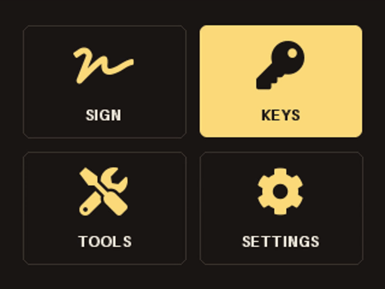
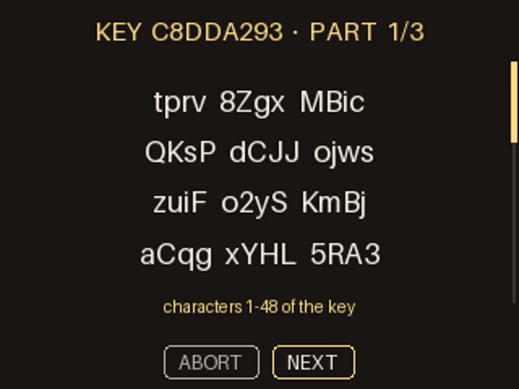
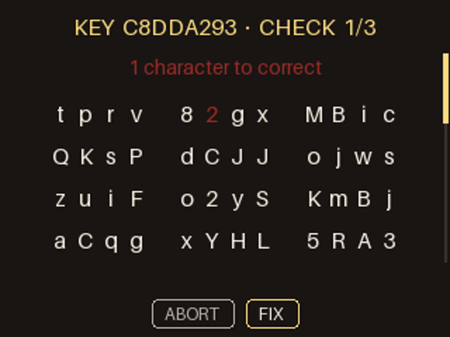
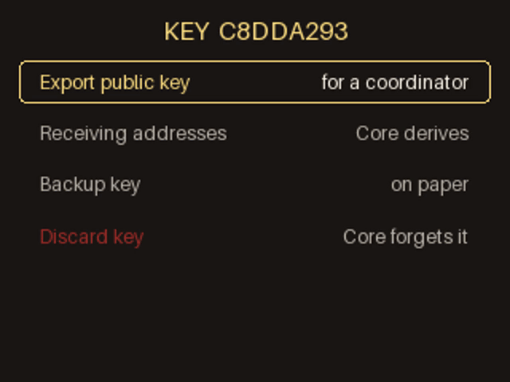
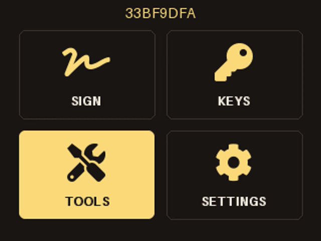
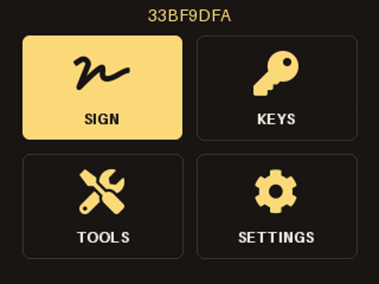

# Core Signer

> ### Experimental. Do not put money on it.
>
> No Core Signer has ever signed a mainnet transaction on hardware, and no
> hardened image has been flashed.
> **Two of the five gates below are measured on a board.**
> Three are not, including the one that proves a power cycle wipes the
> key and the one that proves the radios are off.
> The mainnet signing run of 2026-08-19 happened on a laptop, not on a
> device.
>
> This is a private beta, published so it can be read before it is
> trusted. [Status](#status) says what is measured and what is not, and
> [ISSUES.md](ISSUES.md) is the open list. Use a burner key, on testnet,
> and expect to lose whatever you put on it.

**Core's keys, nothing kept.**

A stateless, air-gapped Bitcoin signer built from general-purpose
hardware, in the tradition of SeedSigner. One difference is the whole
point: **the wallet software is Bitcoin Core itself**, running wallet-only and
offline. Core Signer draws screens, reads buttons and carries bytes. It never
computes anything on a key.

## Why Bitcoin Core's wallet, and not another one

Core Signer reimplements no wallet logic. It does not build transactions and it
does not choose fees: your coordinator does that, whether that is
Sparrow, Bull Bitcoin or Core on a laptop. Core Signer makes and backs up keys,
and it signs. Key derivation, PSBT parsing and signing are all done by
Bitcoin Core, running wallet-only and offline, driven over its own RPC.

The fee on the review screen is not Core Signer's arithmetic either. Core reads
it out of the transaction the coordinator built, from input amounts the
coordinator supplied, and an offline device cannot check those against
the chain. The screen says so.

That shape is not a workaround.
[@instagibbs](https://x.com/theinstagibbs/status/2096565881048269263), a
Bitcoin Core contributor, quote-tweeting "We're all one-shotted Bitcoin
Core contributors now":

> "Moderately hot take: in the age of AI anything that can be split off
> from the repo should. As long as the mechanics of the wallet RPC are
> safe people should just make their own GUI to their liking."

Core Signer is exactly that, built as if it were meant seriously: a GUI over
the wallet RPC, on hardware with no network, that adds nothing to the
parts which handle the key.

### This is more to trust than Core alone, and we are not going to pretend otherwise

Ben Westgate put it to us straight: **"the less code between the user and
Core, the better"**, and **"people have to trust it and it needs to be
easily reviewable if they're going to use it."** He is right on both
counts, and the honest consequence is worth saying before anything else
in this document.

**If you want the least trust available, you do not want Core Signer.** You
want Bitcoin Core's command line on an air-gapped laptop you built
yourself. That is Core's reviewed code and nothing else, and no interface
of ours sits between you and it. It is the smaller thing to check, and it
will still be the smaller thing to check after Core Signer is finished.

Core Signer is Core **plus** a body of new code that draws screens, reads
buttons and moves bytes. That code is young. It has one author and an
audit trail rather than years of adversarial review from strangers. We
verify Core's binaries against the release signatures, and we intend our
own builds to be reproducible, but "intend" is the honest word today.

What Core Signer buys for that cost is the interface, and the interface is not
a luxury. A signer nobody will use protects nobody. The alternative most
people actually reach for is friendlier, custodial in a way they did not
read, and more likely to lose their coins than a command line ever was.

So the claim is narrow, and it is the only one we make: **of the handheld
signers, this is the one whose wallet is Bitcoin Core.** Everything below
is written so you can check that claim rather than take it.

The reason is review depth, and it is measurable rather than sentimental.
Counted on 2026-09-07:

| project | since | contributors | merged PRs, last 12 months |
|---|---|---|---|
| **Bitcoin Core** | 2010 | 343+ | **1,366** |
| Coldcard firmware | 2018 | 53 | 231 |
| SeedSigner | 2020 | 56 | 71 |
| Blockstream Jade | 2021 | 37 | 6 |
| Foundation Passport | 2022 | 12 | 40 |

Those are healthy projects, and merged-pull-request counts include
trivial changes. GitHub does not list every contributor either, so Core's
real figure is higher than the one above. None of this says the others
are careless. It says a change to Core's wallet passes more independent
eyes than a change to any other Bitcoin wallet, that Core's review
convention requires reviewers to publicly ACK a specific commit, and that
the same code is what the network's reference node runs. Bugs are harder
to land there, by construction, and far more is watching if one does.

**The standards tell the same story.** BIP39, the seed phrase, was
written by SatoshiLabs, a hardware wallet vendor. Output descriptors
(BIPs 380 to 386) were written by Pieter Wuille and Ava Chow, Bitcoin
Core contributors. Core has never implemented BIP39.

**The usual argument against seed phrases is aimed wrong**, and this page
made it for months. "Words do not carry the derivation path" is true, and
just as true of an xprv: both are a key and nothing else. The real
comparison is not one key format against another. It is **a key alone
against a descriptor**, and a mnemonic and an xprv lose to a descriptor
in exactly the same way.

For single signature it barely bites, because the four paths are a
convention every wallet already shares. For multisig it bites hard:
nothing recovers a quorum, each cosigner's xpub, their script types and
their paths, so a key alone is useless whichever form it is in. Core Signer is
single signature in v1 and does not meet that problem at all.

**The reason Core Signer takes an xprv is none of that.** Core has no BIP39
and never has. Checked against 31.1: no `sethdseed`, no `importmnemonic`,
no `importseed`. Twelve words are not a thing Core can be handed, so
supporting them would mean Core Signer doing PBKDF2-HMAC-SHA512 and
HMAC-SHA512 itself, to turn words into a key. That is a cryptographic
primitive operating on secret material, which is the one thing this
repository does not contain and
[`tests/test_integrity.py`](tests/test_integrity.py) fails on. Seed words
are not refused here because they are bad. They are refused because
accepting them costs the property the whole design is built on.

### Why that matters more than it sounds

If you are going to concentrate your trust in one piece of software,
Bitcoin Core is the one to concentrate it in: for the node, for the
wallet, for signing, and for generating the key in the first place. It
has the most review, the slowest change process, and the most people
trying to break it.

Multivendor multisig exists so that no single vendor's mistake can lose
your coins. Different hardware, different firmware, different teams, and
a quorum that survives any one of them being wrong. **Bitcoin Core is
missing from that story, and it is the most reviewed implementation
there is.** Not because anyone excluded it. Because everybody else's key
is a BIP39 seed phrase, and Core cannot make one or read one.

A key Core Signer generates is a Core key, so it can go in the quorum. Proven
with Sparrow's own library, 2 of 3, P2WSH:

```
cosigner  Bitcoin Core    563e21ec  m/48'/1'/0'/2'
cosigner  BIP39 vendor 1  73c5da0a  m/48'/1'/0'/2'
cosigner  BIP39 vendor 2  b8688df1  m/48'/1'/0'/2'
```

Real addresses, a real `wsh(sortedmulti(2,…))` descriptor. Sparrow takes
a Core master key as a cosigner beside two ordinary seed phrases.

That is the case for this project stated plainly. If a vendor's key
generation turns out to be wrong, and vendors differ enormously in how
carefully they review a change, a quorum holds as long as the others are
sound. Today none of those others can be Bitcoin Core.

**What Core Signer does not do yet.** Core Signer is single signature in v1: it does
not sign for a quorum, and it does not export a cosigner key. To put a
Core Signer key in a quorum today you type the paper backup into Sparrow,
which means the private key goes into a hot wallet once. Core can derive
the cosigner branch without the key leaving, so exporting it is a real
and small piece of work rather than a limitation of the idea. It is not
done, and until it is, the paragraph above is an argument for the key
format rather than a feature you can use.

**One difference between the two forms is real: a seed phrase can hide a
second secret.** BIP39 allows a passphrase, mixed into the key and
written nowhere. The same twelve words with and without one are two
different wallets, and nothing in the words says whether one was used:

| | |
|---|---|
| twelve words, no passphrase | wallet `73c5da0a` |
| the same twelve words, passphrase `hunter2` | wallet `ca2c62d2` |

Forget it and the words are worth nothing. Core Signer's backup cannot have
one: the key is the key.

**That is a trade, not a win.** A passphrase is also a feature. It is a
second factor, it gives plausible deniability, and it means paper found
in a drawer is not enough on its own. Core Signer removes the footgun and the
capability together, and anyone who wants the capability should know
that is what they are giving up.

Two smaller things follow from the same self-description. Words do not
say which SYSTEM made them, and Electrum's look identical to BIP39's
while deriving something else; `tprv` says exactly what it is. Words do
not say which NETWORK either, and the version bytes do: `xprv` is real
money, `tprv` is not.

### What you actually write down

111 characters, on three screens, and nothing else.

```
tprv8ZgxMBicQKsPeLf4pJhcwYLxWGUchL9xcPHZpf66vpnC
dEE3PbqXk99fFsqmMFqs6GFXR5uXbuDSBS7oQ9ryFGwpnTRC
dFa7AJJwYrCFMF4
```

That is Core's master extended private key. It is a key and only a key:
no derivation path, no script policy, no wallet name.

**A seed phrase is a key and only a key too, and this page used to
pretend otherwise.** The argument for descriptors is not that words lose
your paths, because our own backup loses them in exactly the same way.

**Write down the policy, the path and the fingerprint with it anyway.**
The conventions below will usually recover you without them, and "usually"
is a poor thing to hold a backup together with. Four extra words on the
same page remove the guess:

```
KEY  173E6FC2      <- the fingerprint, shown above the backup
Native segwit      <- the policy
m/84'/0'/0'        <- the path
```

The conventions are why it works when you do not. Every wallet checks the
same four, and you pick the script type when you import:

| | |
|---|---|
| Legacy | `m/44'/0'/0'` |
| Nested segwit | `m/49'/0'/0'` |
| Native segwit | `m/84'/0'/0'` |
| Taproot | `m/86'/0'/0'` |

That is Sparrow's own table, and Core Signer rebuilds exactly that set on
restore. **Tested rather than argued**:
[`tests/sparrow/test_recovery.py`](tests/sparrow/test_recovery.py) hands
those 111 characters to Sparrow's own library, out of its verified 2.5.4
release, with no Core Signer code involved in the recovery at all. For all
four policies Sparrow finds the addresses, signs a real spend, and
Bitcoin Core confirms the network would accept it.

**The edge, because there is one.** The account number is hardcoded
`0h`. A key you loaded as a bare descriptor on some other account is not
recoverable from the paper alone, so keep that descriptor with it. A key
Core Signer generated cannot land there.

### Nothing private leaves except on paper

The backup is the only private thing that ever goes anywhere, and it
goes by hand. What a coordinator gets is public:

```
wpkh([3bd22c95/84h/1h/0h]tpubDC3Amaq5HtW8qxGoTwyDB…/0/*)#85lfyknl
```

An xpub, its origin and a checksum. `tests/e2e_regtest.py` fails if any
exported descriptor carries a private prefix, which is the loudest thing
that check could ever say.

Note the asymmetry: the EXPORT carries the path, because a coordinator
has to know which addresses to watch. The BACKUP does not, because it is
just a key. That is the whole reason a descriptor is worth having and a
key alone is not enough to hand to somebody else.

Greg Maxwell, on the BIPs repository's own comments page for BIP39
([source](https://github.com/bitcoin/bips/wiki/Comments:BIP-0039)):

> "The lack of versioning is a serious design flaw in this proposal. On
> this basis alone I would recommend against use of this proposal."
>
> "The general design is a thinly disguised brainwallet."
>
> "…an attractive nuisance which has directly caused funds loss."

Core Signer takes the other road. The key arrives as an **xprv** or a
**descriptor**, and Bitcoin Core is the only thing that ever parses it.

## Why people build these themselves

There is a long-standing instinct to build a signer out of hardware you
can see: SeedSigner on a radio-free Pi Zero, Bitcoin Core on an
air-gapped laptop, people desoldering the wifi module off a board before
they will trust it. The instinct is right and the results are usually
unfinished, because the hard part is not the signing, it is everything
around it.

Core Signer is that instinct finished. Two builds:

- **The CM4 Lite has no radio at all**, because none was ever fitted.
- **The Pi Zero 2 W pocket build** carries wifi and Bluetooth on the
  board. `image/harden.sh` disables them in firmware, blacklists the
  drivers and moves their firmware aside, and `image/leak-check.sh`
  reports on every one. The chip still has power, though, so software can
  only ever say the radio is unused. The one way to be certain is to take
  the chip off the board, and on a Zero 2 W that is possible: the radio
  sits beside the processor as its own component, not inside it.

The device is stateless either way. The wallet lives on a ramdisk, the
key is entered each session, and power-off wipes it.

## Why it needs a screen

A signer with no screen is a signer most people will not use. The
alternative they reach for instead is usually friendlier, custodial in
some way they did not read, and more likely to lose their coins than the
command line ever was. A good interface is not decoration on a security
product. It is the thing that decides whether the secure option is the
one people actually take.

So every flow below is on the device itself, and these are recordings of
the real screens, drawn by the real code, with real output from Bitcoin
Core on regtest.

**They are silent, and that is all there is.** `make_demo_videos.py`
also writes narrated `.mp4` files, and nobody can play them from this
page: GitHub strips a `<video>` tag out of a rendered README, and serves
a raw or release `.mp4` as `application/octet-stream`, which a browser
downloads rather than plays. So the narration is not a second, fuller
version of this page that a reader is missing. Anything worth saying is
said in the text under each recording.

### Generate a key

Core makes the key with its own randomness, and names it by fingerprint.




### Back it up on paper

111 characters over three pages. There is no file and no encryption.




### Verify the backup

Type it back in. The wrong character is named rather than just refused,
and at the end Core confirms the paper opens this key.




### Export the public key

All four script policies, then a QR carrying the fingerprint, the policy
and the derivation path, so the coordinator can be checked rather than
trusted.




### Check an address

Whether the address on that other screen is really yours. Core answers,
per loaded key.




### Sign a transaction

In by camera, reviewed with Core's numbers, out by camera. Nothing is
ever plugged in.




Rebuild them with `python3 tools/make_demo_videos.py`, which needs
`bitcoind`, `ffmpeg` and a Mac. Nothing in that script is a mockup: it
asks Core for a real key and a real transaction and photographs the
screens Core Signer draws. Nothing leaves the machine either, because the
narration is macOS `say`.

## What you are trusting

Core Signer sees your key at two moments. On the way in, as a string it hands
to Core through [`bitcoin-cli -stdin`](coresigner/signer.py), never on the
command line, so it is never in a process listing. And on the way out to
paper, as characters on the panel. Between those, the key lives in
Bitcoin Core and in a ramdisk, and power-off ends both.

The code is in three layers, and the first one is the claim that matters:

**Layer 1 transforms secret material. 0 lines of Core Signer.** Nothing in
this repository computes on a key. Every derivation, every signature and
every byte of BIP32 arithmetic happens inside two binaries that are not
ours:

| | |
|---|---|
| `bitcoind` 31.1, aarch64, stripped | 16.4MB |
| `bitcoin-cli` | 2.6MB |

Both are the official builds, pinned by sha256 in
[`image/PINS`](image/PINS), checked against 11 GPG signatures on
`SHA256SUMS` taken out of band from the guix.sigs repository rather than
from the server that served the binary, and re-verified from a fresh
download on 2026-09-08. That is the layer that does the cryptography,
and the reason this project exists is that it has thousands of readers
and Core Signer's 2,407 lines do not.

Layer 1 being empty is enforced, not asserted.
[`tests/test_integrity.py`](tests/test_integrity.py) fails if any shipped
module imports `hashlib`, `hmac`, `secrets`, `random` or any curve
library, if `os.urandom` appears anywhere, or if key-derivation
vocabulary comes back.

**Layer 2 sees secrets, computes nothing with them. 2527 lines.**
[`main.py`](coresigner/main.py), [`signer.py`](coresigner/signer.py),
[`screens.py`](coresigner/screens.py), [`qrsource.py`](coresigner/qrsource.py).

**Yes, this is Core Signer's own code, and yes it holds your actual private
key.** Not a hash of it, not a handle to it: the xprv itself, in plain
text, as an ordinary Python string. Four things happen to it and they
are the whole list:

| | |
|---|---|
| `qrsource.py` | hands over what the camera decoded, which on Scan-a-key is the key |
| `main.py` | holds that string, or the one you typed, and passes it on |
| `signer.py` | writes it to `bitcoin-cli`'s **stdin**, never its arguments |
| `screens.py` | draws it on the panel, which is the paper backup |

What "computes nothing with them" means precisely: no line in any of
those four derives a child key, hashes it, checks it, or turns it into
anything. They move it and they draw it. The one place a key is
inspected at all is a check on the first four characters to decide which
screen to open, which is why `XPRV_PREFIXES` is one list used by both
the redactor and the argument guard.

**The known exposure**, said plainly: while a key is loaded, a copy of
it exists in Core Signer's Python memory as well as in Core's. Python strings
cannot be reliably wiped. What bounds it is that the board has no swap,
the datadir is a ramdisk, and power-off ends the session, so the copy
lives as long as the session and not one second longer.
[`tests/test_no_persistence.py`](tests/test_no_persistence.py) is the
suite that keeps that true.

**Layer 3 never touches secrets at all. 268 lines.** Also Core Signer's own
code: [`filechannel.py`](coresigner/filechannel.py) and
[`qrchannel.py`](coresigner/qrchannel.py), plus the panel driver and the
buttons.

These handle only transactions and public keys. A PSBT is not a secret,
and neither is a descriptor with an xpub in it. The risk here is a
different one and worth naming: this is the layer that parses bytes a
stranger chose. A hostile QR frame or a malformed file arrives here
first. So it never parses a PSBT, it only detects the encoding and hands
Core an opaque string, and the one exception is documented at the top of
`qrchannel.py`: the UR container has to be unwrapped to get at the
payload, which is bounded by a length cap and a charset check before any
container code runs.

**Total functional code: 2,795 lines** (5,863 with blanks/comments).
**Test code: 7,178 lines**, none of which ships.
**Vendored, not ours: 1,868 lines** in [`hw/vendor/`](hw/vendor/): the
BC-UR animated-QR codec, which is Blockchain Commons' by way of
SeedSigner and is unmodified, and SeedSigner's ST7789 display driver,
which is **modified** to stand alone without its base class. The driver
names its source in the file. The codec names its source once
for the whole directory, in
[`hw/vendor/ur2/VENDORED.md`](hw/vendor/ur2/VENDORED.md), because a
header line in each file would change the very hash that proves the file
unmodified.

**Every one of those lines runs on the device.** That sentence was false
until 2026-09-08: a second SeedSigner display driver was vendored for a
2.4" panel no code path could select, and 383 lines an auditor had to
read could never run. It is deleted. `tests/test_readme_claims.py` works
out which vendored files are reachable rather than trusting this
paragraph, and fails the moment one stops being.
`tests/test_vendor_pinned.py` records the sha256 of each file, so a
change to any of them is a failing test rather than a surprise.

**"Audit upstream" is a fact here, not a phrase.** Every vendored file
was compared byte for byte with SeedSigner at commit `85cd9a0211ee` on
2026-09-08, and the result is in
[`tests/vendor-upstream.json`](tests/vendor-upstream.json): 15 of 16
identical, the one display driver modified and saying so at the top.
The pin is a commit and not a branch, so it does not move. Repeat it
with `python3 tests/test_vendor_pinned.py --verify-upstream`, which
fetches that same commit and re-derives every hash.

One of those modifications is a bug fix upstream does not have.
SeedSigner's `SetWindows` hardcodes the high octet of every coordinate to
zero, which is right only below 256 pixels; on Core Signer's 320-wide primary
panel it addresses a 64-column window. That belongs upstream and we will
send it.

## Where the key comes from

Core Signer ships no randomness. No `os.urandom`, no `random`, no `secrets`,
[enforced by a test](tests/test_integrity.py). It asks **Bitcoin Core**
to generate the key, in the wallet it then signs with, and hands you
Core's own master private key as the backup, read verbatim from Core's
descriptors ([PLAN A-19](PLAN.md)).

Dice and cards cannot make a key here. Turning rolls into a key needs
BIP32 master derivation, which is HMAC-SHA512, and no cryptographic
primitive is imported anywhere. Core's `sethdseed` went with the legacy
wallets and is gone from v31.1.

## What it cannot do

Said before critics find it:

- **No seed phrase.** You cannot bring 12 or 24 words from another
  wallet, and the backup is 111 characters written by hand.
- **No multisig** in v1. Single signature only.
- **Python on the signing path.** Nothing about the language protects
  memory. A Python string cannot be reliably wiped, so while a key is
  loaded there is a copy of it in Core Signer's memory that nothing can
  scrub. What protects it is not the language: the board has no swap,
  the datadir is a ramdisk, and power-off ends the session, which
  [a test proves](tests/test_no_persistence.py).
- **The radio chip on a Zero 2 W still has power** after hardening. The
  overlays unbind the driver and the firmware never loads, so nothing
  can drive it, and every check Core Signer runs is a check on the operating
  system. No script can prove a chip is unpowered, because the thing
  doing the proving is running on the same board. Raspberry Pi documents
  a hardware disable pin for the Compute Modules and not for the Zero
  2 W. **What settles it is removing the part.** On a Zero 2 W the radio
  is a separate component beside the processor rather than inside it, so
  it can be desoldered, and then the answer stops depending on software
  at all.
- **150 inputs**, and the device refuses more. That is this board's
  memory, measured, not a policy.

## How it is tested

`./run_tests.sh`, and `RUN_NODE=1 ./run_tests.sh` adds the suites that
need a real `bitcoind`. The rules that came out of being wrong are in
[TESTING.md](TESTING.md).

- **86% of `coresigner/`** executes under test, measured across both
  architectures, with every uncovered line sorted into one of three piles
  and exactly one statement unreachable
  ([A5](docs/wayfinder/beta-audit/tickets/A5-never-run.md)).
- **21 scripted device sessions** drive the real keypad and assert what
  the panel actually painted.
- **7 adversarial attack scenarios**, including a hostile stick, a FIFO,
  a lying coordinator and a full medium.
- **132 checks against Sparrow's own library**, out of its sha256
  verified release, so the QR codes are read by the software that will
  really read them and not by our own decoder
  ([`tests/sparrow/`](tests/sparrow/)).
- **Two real mainnet spends**, ECDSA
  ([`19d1180b…`](https://mempool.space/tx/19d1180b816e00c1d272a25bda3caf1dc466b70c24ba128aee25e1a32b61cf41))
  and a Taproot keyspend
  ([`0ee96d29…`](https://mempool.space/tx/0ee96d2995f73768f071954c5b116fcb894847289a94dbe313e6b8615cd9981d)).

[`tests/test_readme_claims.py`](tests/test_readme_claims.py) fails the
suite if any number on this page drifts from the tree.

## What runs on the signer

Everything the device carries, and nothing else.
[`tests/test_integrity.py`](tests/test_integrity.py) holds the same list
as an import allowlist, so adding one means changing this section,
[`image/PINS`](image/PINS) and
[`image/provision.sh`](image/provision.sh) on purpose.

| | source |
|---|---|
| Raspberry Pi OS Lite 64-bit | pinned in `image/PINS` |
| Bitcoin Core 31.1 | official binary, sha256 pinned, 11 GPG signatures checked out of band |
| Pillow, picamera2, spidev, RPi.GPIO, libzbar0, pip | apt |
| qrcode, pyzbar, and their two dependencies | pip, pinned by **sha256** in `image/requirements.txt` and installed with `--require-hashes` |
| ST7789 driver, BC-UR codec, icon font | vendored in `hw/vendor/`, MIT/BSD/CC-BY |

Verify a device against this repository with
[`image/verify-install.sh`](image/verify-install.sh), which compares
every installed file, both Core binaries and the ramdisk against what is
committed here. It needs nobody's word.

## Status

M0 depends on the transaction's shape. Re-measured on the board
2026-09-06, at 250 inputs: **187MB of headroom** on ordinary payments
(pass), and exchange-batch consolidations pass to 175 inputs and fail
from 200. The ceiling is bitcoind's memory, not Core Signer's, so the device
refuses past 150 inputs rather than dying mid-sign.

M1 passed except the optics, and the camera now reads a real Sparrow
frame on the board.

**Not yet proven:** a coordinator's camera reading this panel, a hardened
image with the radios actually off, and a reproducible build. The
[beta audit](docs/wayfinder/beta-audit/map.md) records all of it, and
[ISSUES.md](ISSUES.md) is the open list.

| gate | question | measured on a board |
|---|---|---|
| M0 | does wallet-only bitcoind fit in 512MB | yes, 2026-09-06 |
| M1 | camera QR capture, both directions | yes, except the optics |
| M2 | stateless UI on the panel, power cycle provably wipes | no |
| M3 | hardened reproducible image, radios dead | no |
| M4 | mainnet trial on hardware | no |

The warning at the top of this page counts that last column, and
`tests/test_readme_claims.py` counts it too, so the two cannot drift.
